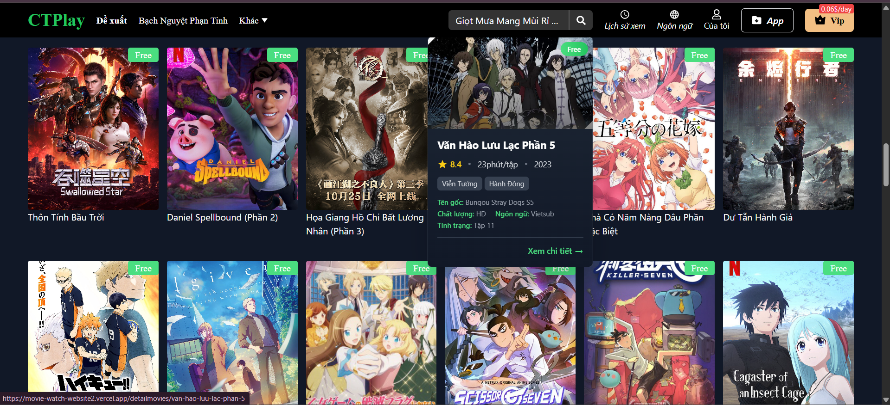
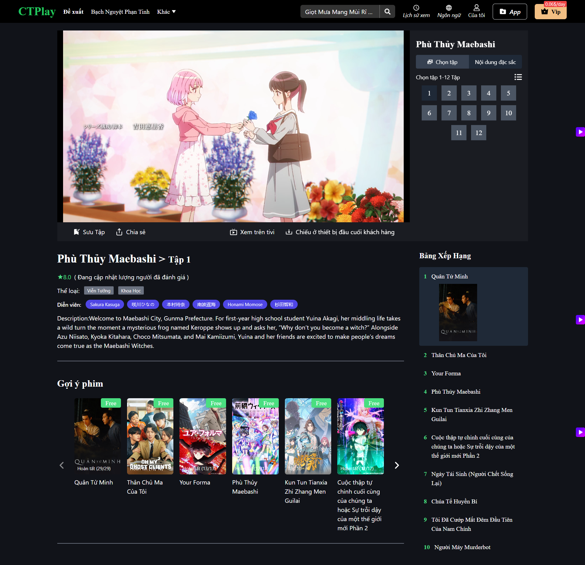
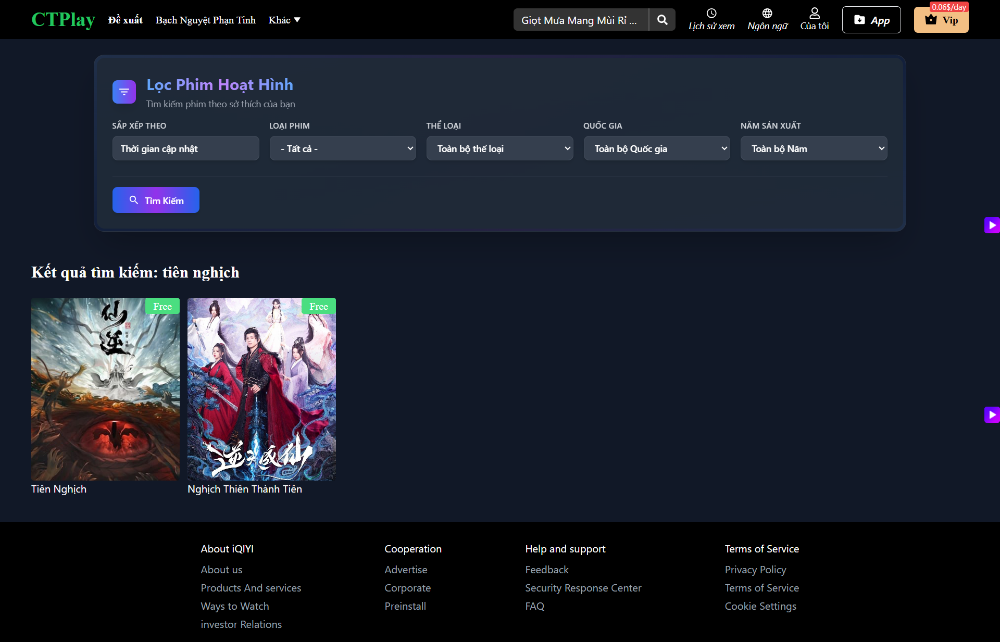

# 🎬 CTPLAY

## 📖 Overview

**CTPLAY** is a modern web application built with **React** and **TypeScript**, designed to deliver a smooth and responsive user experience similar to modern streaming platforms. The application focuses on seamless video playback, dynamic data loading, and a responsive interface suitable for all devices.

---

## 🚀 Link test

https://movie-watch-website2.vercel.app/

## 🚀 Features

- **🎥 Video Streaming**: Stream videos with adaptive quality using `hls.js`.
- **🗂️ Content Browsing**: Browse movies and TV shows through a user-friendly interface.
- **⚡ Dynamic Data Fetching**: Efficient data management with `@tanstack/react-query` and `axios`.
- **🔀 Routing**: Client-side navigation powered by `react-router-dom`.
- **📱 Responsive Design**: Mobile-first layout styled with `tailwindcss`.
- **🛡️ Sanitized Content**: Securely render HTML content with `dompurify`.
- **🎨 Icon Support**: Integrated icon library using `react-icons`.

---

## 🧱 Tech Stack

### Frontend

| Technology                | Description                          |
| ------------------------- | ------------------------------------ |
| **React**                 | JavaScript library for building UIs  |
| **react-dom**             | React DOM rendering                  |
| **react-router-dom**      | Client-side routing                  |
| **@tanstack/react-query** | State management & data fetching     |
| **axios**                 | Promise-based HTTP client            |
| **hls.js**                | HTTP Live Streaming video playback   |
| **dompurify**             | Sanitize HTML to prevent XSS attacks |
| **react-icons**           | Icon library for UI elements         |
| **tailwindcss**           | Utility-first CSS framework          |
| **vite**                  | Fast build tool for dev/prod         |
| **TypeScript**            | Strongly typed JavaScript            |

---

### 🛠 Development Tools

- **eslint**: Linting for code quality
- **jest**, **ts-jest**: Testing framework
- **@testing-library/react**: React component testing utilities
- **@vitejs/plugin-react**: React plugin for Vite
- **autoprefixer**, **postcss**: CSS post-processing
- **typescript-eslint**: TypeScript linting rules

---

## 🧪 Installation

### ✅ Prerequisites

- Node.js >= 18.x
- npm or yarn

### 📦 Setup

```bash
# Clone the repository
git clone https://github.com/your-username/CTPLAY.git

# Navigate to the project directory
cd CTPLAY

# Install dependencies
npm install
# or
yarn install

# Start the development server
npm run dev
# or
yarn dev
```

### Page Home


### Hover Movie



### Detail movie


### Page film



### Page Search By Name



### Page Search By Key


